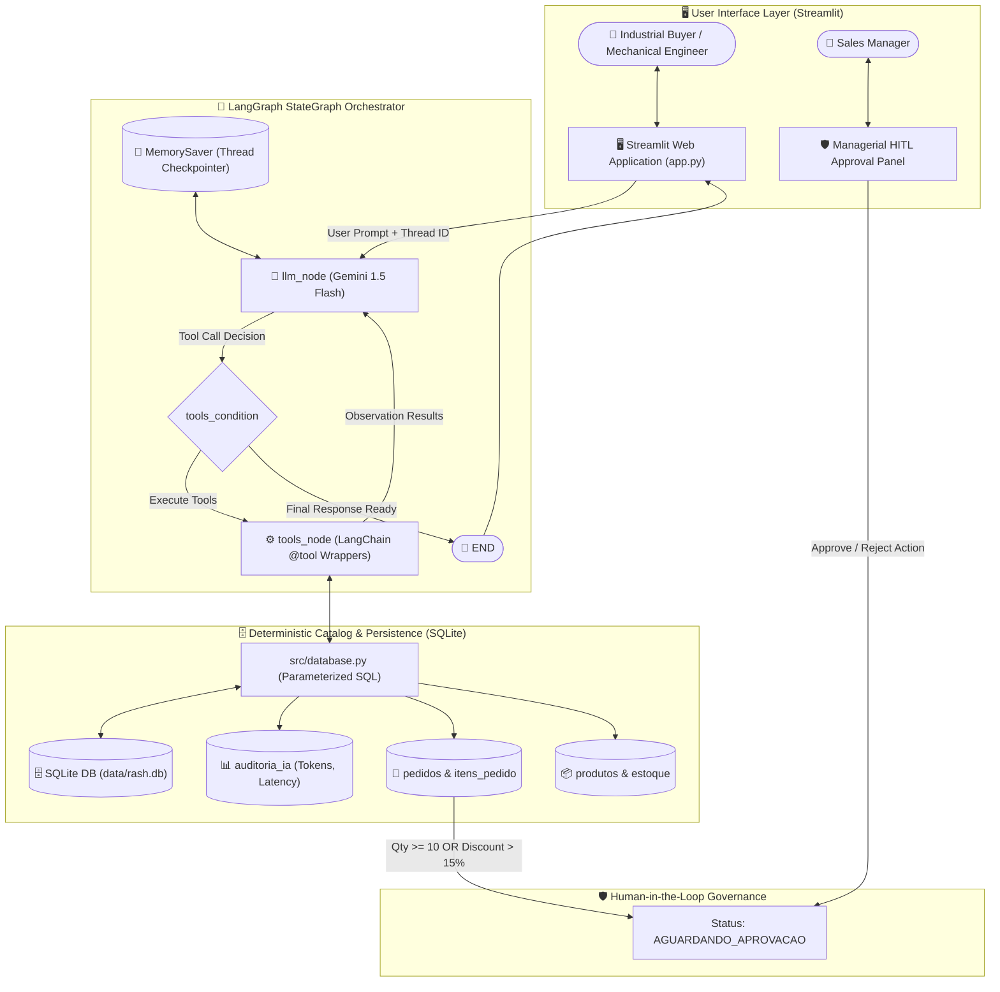

<div align="center">

# ⚙️ Rash Rolamentos Industriais — B2B Technical Sales Agent & Governance

[](https://rash-rolamentos.streamlit.app/)
[](./README_pt.md)
[](https://rash-rolamentos.streamlit.app/)

<br/>


<br/>

[](https://www.python.org/)
[](https://docs.astral.sh/uv/)
[](https://astral.sh/ruff)
[](https://langchain-ai.github.io/langgraph/)
[](https://streamlit.io/)
[](LICENSE)
[](.github/workflows/ci.yml)

<p align="center">
  <strong>Technical Challenge & Business Case Solution: Autonomous B2B Technical Sales Agent with Deterministic Catalog Resolution, LangGraph State Orchestration, and Human-in-the-Loop (HITL) Governance.</strong>
</p>

</div>

---

## 🧭 Navigation

- 🌐 **[Live Demo on Streamlit Cloud](https://rash-rolamentos.streamlit.app/)**
- 📄 **[Product Requirements Document (PRD)](./docs/PRD.md)**
- 🏛️ **[Technical Architecture & Data Flow](./docs/ARCHITECTURE.md)**
- 🇧🇷 **[Versão em Português](./README_pt.md)**

---

## 💼 Business Case & Technical Challenge Context

This repository presents an end-to-end **Technical Challenge & Business Case Solution** designed for industrial B2B sales automation at **Rash Rolamentos Industriais**.

### The Core Problem
In mechanical and heavy-machinery distribution, generic conversational AI chatbots fail because they **hallucinate dimensional tolerances, mechanical load ratings, and commercial pricing**. Quoting the wrong clearance ($C3$ vs. normal) or incorrect shaft diameter can cause catastrophic machinery breakdown on the factory floor.

### The Agentic Solution
**RashBot** resolves this fundamental business problem by combining conversational natural-language understanding with a **100% Deterministic SQLite Catalog Layer** and strict **Human-in-the-Loop (HITL)** governance:

- 🎯 **Zero Catalog Hallucination:** Dimensions ($d, D, B$), radial clearance, load capacities, inventory, and prices are resolved exclusively via parameterized relational SQL.
- ⚡ **Consultative Engineering Search:** Converts vague operating descriptions (e.g., *"high-vibration jaw crusher in mining"*) into exact ISO bearing codes (`22212-E`, `6204-2RSH`).
- 🛡️ **Managerial HITL Guardrails:** Formal quotes exceeding order volume ($\ge 10\text{ units}$) or discount ceilings ($> 15\%$) enter a pending status (`AGUARDANDO_APROVACAO`), requiring human manager review before dispatch.

---

## 📊 Key Metrics & Business Impact

| Metric / Dimension | Traditional Manual Workflow | RashBot Agentic Platform | Measured Business Impact |
| :--- | :--- | :--- | :--- |
| **Catalog Accuracy** | Manual cross-referencing errors | **100% Deterministic** via SQLite engine | **0% Hallucination** on dimensions, specs & prices |
| **Quote Turnaround** | 2 to 4 hours per request | **< 30 seconds** interactive session | **> 90% reduction** in commercial lead latency |
| **Commercial Governance** | Ad-hoc spreadsheet approvals | Automated **HITL triggers** for alçada limits | 100% policy enforcement on high-volume quotes |
| **Observability & Cost** | Unmonitored token overhead | Session-based token & latency audit | Full audit trail in `auditoria_ia` table |

---

## 🏗️ Architecture & LangGraph Decision Flow

The system orchestrates multi-turn technical negotiation through a stateful **LangGraph StateGraph**, utilizing **Google Gemini 1.5 Flash** for intent parsing and dedicated LangChain tools for catalog access.



---

## 📸 Application Preview & User Experience

Explore the operational interface built with custom Streamlit design components:

| Operational Dashboard | Technical Recommendation |
| :---: | :---: |
|  |  |
| *1. Clean consultation dashboard* | *2. Exact parametric search & matching* |

| Inventory & Buyer Details | Interactive Chat & Governance |
| :---: | :---: |
|  |  |
| *3. Stock check & customer data input* | *4. Real-time reasoning & HITL quotation* |

---

## ⚖️ Engineering Decisions & Trade-offs

### 1. Deterministic Relational Database (SQLite) vs. Vector Embeddings (RAG)
- **Trade-off:** Semantic vector embeddings are excellent for fuzzy similarity, but prone to catastrophic matching errors with numeric dimensions (e.g., confusing a $20\text{ mm}$ inner diameter with $25\text{ mm}$ or ignoring a $C3$ radial clearance suffix).
- **Decision:** We use parameterized SQLite queries for 100% deterministic technical and pricing precision. Natural language understanding is confined to mapping customer intent to SQL query parameters.

### 2. LangGraph StateGraph vs. Linear LangChain Chains
- **Trade-off:** Industrial sales conversations are cyclical and non-linear (buyers jump between asking for specs, checking stock, altering order volumes, and finalizing quotes).
- **Decision:** LangGraph's cyclic StateGraph architecture provides robust tool routing, conversation rollback, and thread-level state memory via `MemorySaver`.

### 3. Human-in-the-Loop (HITL) Gate vs. Autonomous Transactional Checkout
- **Trade-off:** Full autonomy accelerates checkout but exposes distributors to commercial liabilities (unauthorized discount promises or warehouse overselling).
- **Decision:** Hard threshold triggers (`quantity >= 10` or `discount > 15%`) lock quotations in `AGUARDANDO_APROVACAO` state until reviewed by a sales supervisor.

---

## 🚀 Quickstart Guide

This project uses **[uv](https://docs.astral.sh/uv/)** for fast, deterministic Python environment management.

### 1. Clone the Repository
```bash
git clone https://github.com/SueliHora/rash-rolamentos.git
cd rash-rolamentos
```

### 2. Install Dependencies
```bash
# Sync virtual environment with pinned dependencies & dev tools:
uv sync --all-extras --dev
```

### 3. Configure Environment Variables
```bash
# Windows (PowerShell):
Copy-Item .env.example .env

# Linux / macOS:
cp .env.example .env
```

Edit `.env` with your Google Gemini credentials:
```env
GEMINI_API_KEY=your_gemini_api_key_here
GEMINI_MODEL=gemini-1.5-flash
LOG_LEVEL=INFO
```

### 4. Initialize and Seed the Database
```bash
uv run python data/seed.py
```

### 5. Run Quality Checks & Automated Tests
```bash
# Run Ruff linter:
uv run ruff check .

# Run Pytest suite:
uv run pytest -v
```

### 6. Launch the Web Application
```bash
uv run streamlit run app.py
```

Open your browser at **[http://localhost:8501](http://localhost:8501)**.

---

## 📂 Repository Structure

```text
rash-rolamentos/
├── .github/
│   └── workflows/
│       └── ci.yml             # GitHub Actions CI pipeline (Ruff + Pytest)
├── assets/
│   ├── README.md              # Asset standards and screenshot guidelines
│   ├── logo_clean.png         # Brand logo
│   └── app_preview*.jpg       # UI walkthrough screenshots
├── data/
│   ├── rash.db                # SQLite database (auto-generated)
│   ├── schema.sql             # Relational DDL schema
│   └── seed.py                # Deterministic catalog seeder
├── docs/
│   ├── PRD.md                 # Product Requirements Document
│   ├── ARCHITECTURE.md        # Deep-dive Architecture & Data Flow
│   └── adr-001-*.md           # Architectural Decision Record (ADR)
├── src/
│   ├── agent.py               # LangGraph StateGraph orchestrator
│   ├── database.py            # Parameterized SQLite data layer
│   ├── tools.py               # LangChain @tool wrappers
│   ├── test_agent.py          # Terminal-based agent test runner
│   └── test_db.py             # Database query test suite
├── tests/
│   └── test_basic.py          # Pytest unit & integration test suite
├── .env.example               # Documented environment variable template
├── .gitignore                 # Git ignore rules
├── AGENTS.md                  # Development guidelines for AI Agents
├── app.py                     # Streamlit web application & HITL dashboard
├── LICENSE                    # MIT License
├── pyproject.toml             # uv package configuration & tool settings
├── README.md                  # Official documentation (English)
└── README_pt.md               # Official documentation (Portuguese)
```

---

## 👩‍💻 Author & License

- **Author:** [SueliHora](https://github.com/SueliHora)
- **Repository:** [https://github.com/SueliHora/rash-rolamentos](https://github.com/SueliHora/rash-rolamentos)
- **Live Demo:** [Streamlit Cloud](https://rash-rolamentos.streamlit.app/)
- **License:** Distributed under the [MIT License](LICENSE).
