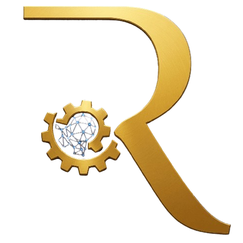
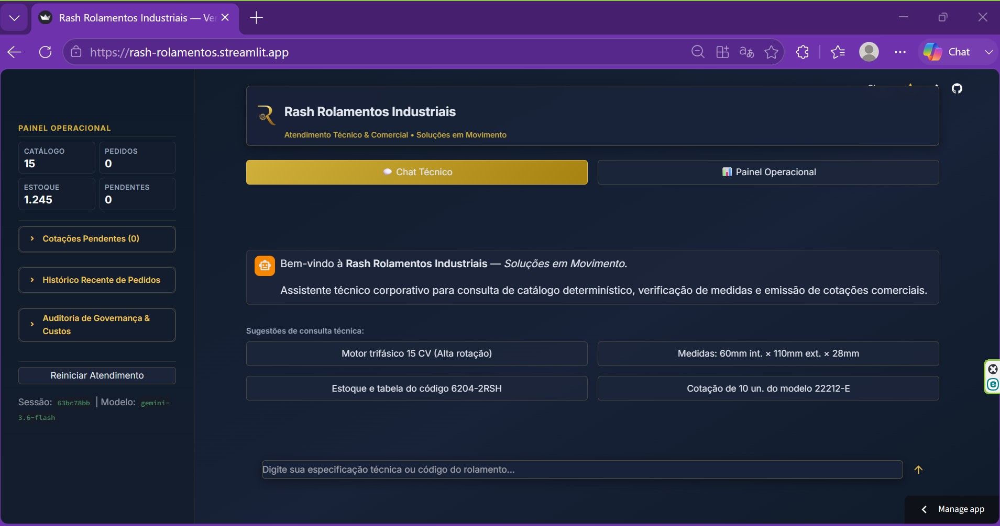
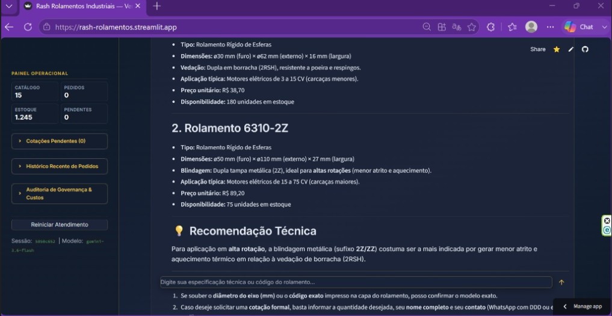
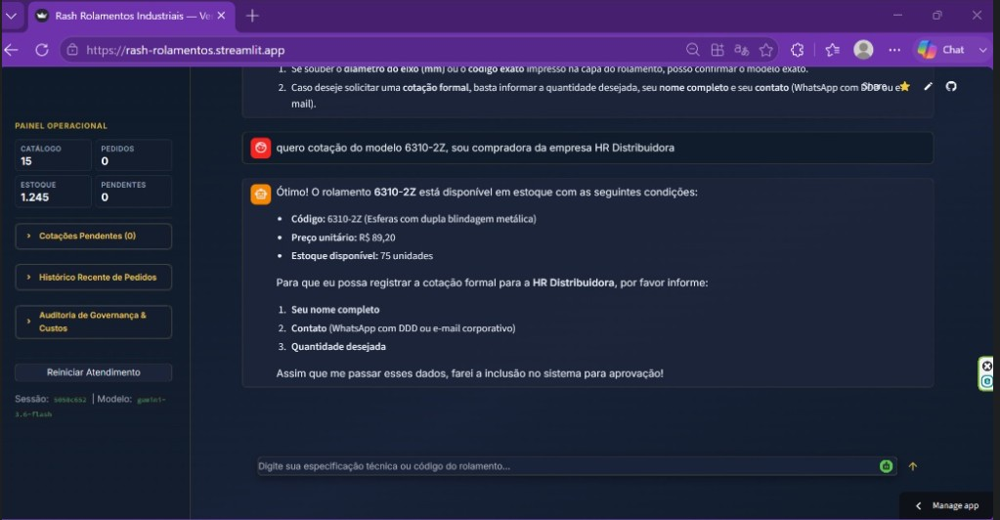
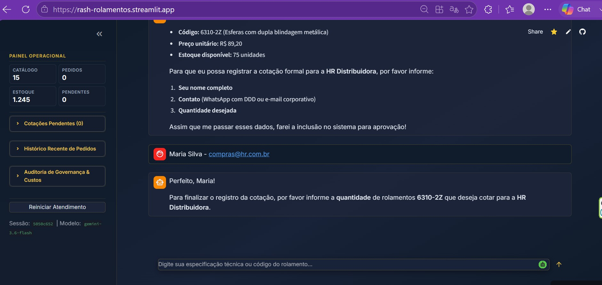
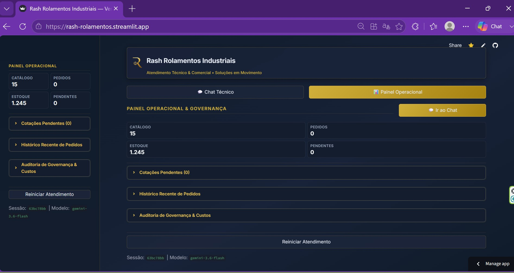

# ⚙️ Rash Rolamentos Industriais — Agente de Vendas Técnicas & Governança



> **Agente Conversacional Autônomo com Raciocínio Determinístico, Catálogo Técnico B2B, Orquestração LangGraph / LangChain e Governança Human-in-the-Loop (HITL).**

---

## Visão Geral do Projeto

A **Rash Rolamentos Industriais** é uma solução corporativa de ponta a ponta desenvolvida para resolver os principais gargalos de atendimento técnico e comercial em vendas B2B de componentes mecânicos de alta precisão.

Diferente de chatbots conversacionais genéricos que alucinam especificações, este agente opera sobre um **catálogo determinístico estruturado (SQLite)**, garantindo conformidade dimensional exata, validação de estoque em tempo real, cálculo auditável de descontos e barreira de segurança humana (*Human-in-the-Loop*) para cotações de alto volume.

---

## Arquitetura da Solução & Fluxo de Decisão

```text
[ Usuário / Engenharia do Cliente ]
              │
              ▼
    [ Interface Web Streamlit ]
              │ (Query de Entrada)
              ▼
 [ Orquestrador LangGraph / LangChain ] ◄──► [ Memória de Conversa (Thread Memory) ]
              │
   ┌──────────┴───────────────────────────┐
   ▼                                      ▼
[ Tool: Consulta Técnica & Aplicação ]  [ Tool: Validação Comercial & Estoque ]
   │ (Dimensões / Carga / Aplicação)      │ (Estoque / Preço de Tabela / Descontos)
   ▼                                      ▼
[ Banco de Dados Determinístico (SQLite: rash.db) ]
              │
              ▼
   [ Regra de Negócio: Volume >= 10 un. ou Desconto > 15%? ]
          ├───────────────┬───────────────┤
         NÃO             SIM              │
          │               │               ▼
          ▼               ▼     [ Painel HITL / Auditoria ]
 [ Emissão Direta ]  [ Status: Pendente ] ──► (Aprovação / Rejeição Humana)
```

---
---

## 📸 Prévia da Aplicação em Ação

Abaixo estão as capturas de tela demonstrando o fluxo completo de atendimento do **RashBot** na interface Streamlit, desde a página inicial e painel operacional até a consulta técnica, validação de estoque e registro de cotações:











---

## Stack Tecnológica

- **Gerenciador de Pacotes & Ambiente:** [uv](https://docs.astral.sh/uv/) + `pyproject.toml` (Python 3.11+)
- **Core do Agente & Orquestração:** LangGraph / LangChain / Gemini 1.5 Flash (`langchain-google-genai`)
- **Camada de Dados & Catálogo:** SQLite 3 (Estrutura relacional normalizada com seeds determinísticos)
- **Interface do Usuário (Frontend):** Streamlit com injeção de CSS customizado e componentes reativos
- **Governança & Segurança:** Human-in-the-Loop (HITL), rastreamento de tokens por sessão e aprovação de alçadas

---

## Estrutura do Repositório

```text
rash-rolamentos/
├── assets/
│   ├── logo.png                # Asset de marca original
│   ├── logo_clean.png          # Logo com fundo transparente
│   └── logo_icon.png           # Ícone da aplicação
├── data/
│   ├── rash.db                 # Banco de dados SQLite persistente
│   ├── schema.sql              # DDL estrutural de tabelas
│   └── seed.py                 # Script de população do catálogo
├── docs/
│   ├── adr-001-stack-e-governanca.md # Registro de Decisão Arquitetural (ADR)
│   └── PRD.md                  # Product Requirements Document
├── src/
│   ├── agent.py                # Implementação do agente LangGraph
│   ├── database.py             # Camada de queries determinísticas
│   ├── tools.py                # Ferramentas determinísticas
│   ├── test_agent.py           # Testes automatizados do agente
│   └── test_db.py              # Testes de consistência do catálogo
├── .env.example                # Template de variáveis de ambiente
├── .gitignore                  # Arquivos ignorados pelo Git
├── AGENTS.md                   # Diretrizes técnicas para agentes de IA
├── app.py                      # Interface Web Streamlit
├── main.py                     # Entry point alternativo
├── pyproject.toml              # Dependências e metadados uv
├── uv.lock                     # Lockfile determinístico uv
└── README.md                   # Documentação técnica oficial
```

---

## Como Executar o Projeto Localmente

Este projeto utiliza o **[uv](https://docs.astral.sh/uv/)** para gerenciamento de ambiente virtual e dependências via `pyproject.toml`.

### 1. Clonar o Repositório

```bash
git clone https://github.com/SueliHora/rash-rolamentos.git
cd rash-rolamentos
```

### 2. Instalar Dependências com UV

O `uv` sincroniza automaticamente o ambiente virtual e instala as dependências fixadas no `uv.lock`:

```bash
uv sync
```

### 3. Configurar Variáveis de Ambiente

Crie o seu arquivo `.env` a partir do template disponibilizado:

```bash
# Windows (PowerShell):
Copy-Item .env.example .env

# Linux / macOS:
cp .env.example .env
```

Edite o arquivo `.env` e configure as variáveis de ambiente:

```env
GEMINI_API_KEY=sua_chave_do_google_ai_studio_aqui
GEMINI_MODEL=gemini-1.5-flash
LOG_LEVEL=INFO
```

### 4. Popular o Catálogo de Dados (SQLite)

Execute o script de seed para criar as tabelas e popular o catálogo inicial de rolamentos:

```bash
uv run python data/seed.py
```

### 5. Executar os Testes Automatizados (Opcional)

Valide a consistência das queries do catálogo e os fluxos do agente:

```bash
# Teste de consistência do banco de dados:
uv run python src/test_db.py

# Teste das ferramentas e raciocínio do agente:
uv run python src/test_agent.py
```

### 6. Iniciar a Aplicação Web

Inicie o servidor Streamlit através do `uv run`:

```bash
uv run streamlit run app.py
```

Acesse a interface no navegador em: [http://localhost:8501](http://localhost:8501)

---

## Principais Funcionalidades

- **Busca Técnica Dimensional:** Consulta determinística por diâmetro interno, diâmetro externo, largura e folga radial.
- **Recomendação por Aplicação Industrial:** Análise técnica para ambientes com cargas combinadas, alta temperatura, vibração severa ou motores elétricos.
- **Cálculo Comercial Auditável:** Validação de estoque em tempo real e cálculo de descontos por faixa de quantidade.
- **Esteira de Governança HITL:** Bloqueio automático de cotações que ultrapassam limites de alçada (volume $\ge$ 10 un. ou desconto $>$ 15%), encaminhando para aprovação no painel lateral de governança.

---

## Autoria & Licença

- **Autora:** [SueliHora](https://github.com/SueliHora)
- **Repositório:** [https://github.com/SueliHora/rash-rolamentos.git](https://github.com/SueliHora/rash-rolamentos.git)
- **Licença:** Distribuído sob a licença MIT. Consulte o arquivo [LICENSE](LICENSE) para mais detalhes.

---

## Reconhecimentos & Créditos

Projeto desenvolvido como parte do desafio prático da **Jornada de Dados**, com customização arquitetural, catálogo determinístico B2B, interface corporativa e governança HITL implementados de forma autônoma.

---

## 🔗 Links Oficiais

- **Aplicação ao Vivo:** [Acessar no Streamlit Cloud](https://rash-rolamentos.streamlit.app/)
- **Repositório do Código Fonte:** [GitHub - SueliHora/rash-rolamentos](https://github.com/SueliHora/rash-rolamentos)
