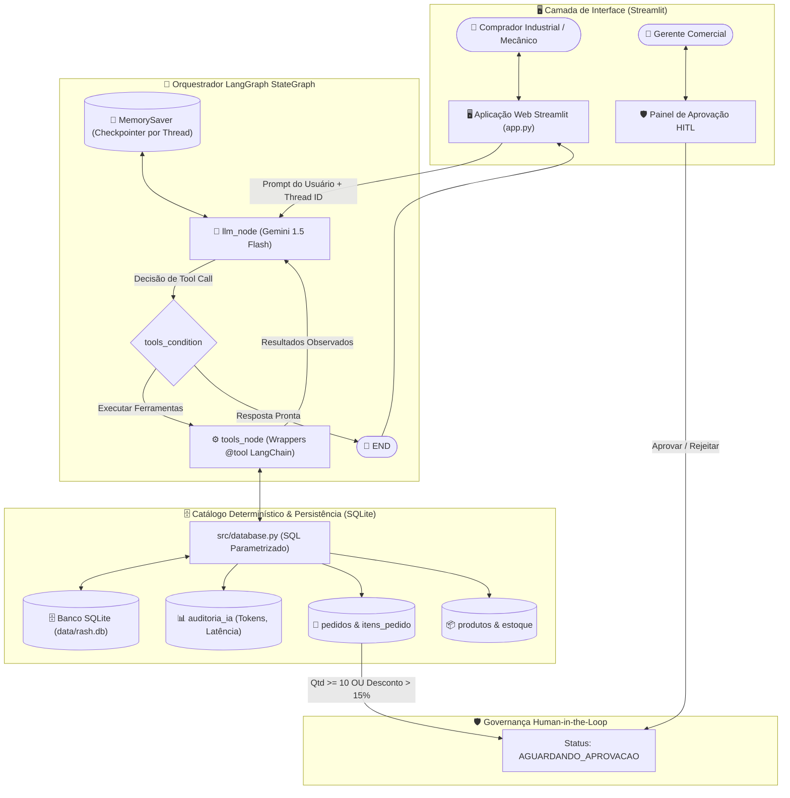

<div align="center">

# ⚙️ Rash Rolamentos Industriais — Agente de Vendas Técnicas & Governança B2B

[](./README.md)

<br/>


<br/>

[](https://www.python.org/)
[](https://docs.astral.sh/uv/)
[](https://astral.sh/ruff)
[](https://langchain-ai.github.io/langgraph/)
[](https://streamlit.io/)
[](LICENSE)
[](.github/workflows/ci.yml)

<p align="center">
  <strong>Assistente Autônomo de Vendas Técnicas B2B com Catálogo Determinístico, Orquestração LangGraph e Governança Human-in-the-Loop (HITL).</strong>
</p>

</div>

---

## 🧭 Navegação

- 📄 **[Documento de Requisitos do Produto (PRD)](./docs/PRD.md)**
- 🏛️ **[Arquitetura Técnica & Fluxo de Dados](./docs/ARCHITECTURE.md)**
- 🤝 **[Guia de Contribuição](./CONTRIBUTING.md)**
- 🇺🇸 **[Read in English](./README.md)**

---

## 📌 Visão Geral do Projeto

No setor de distribuição industrial técnica, chatbots generativos genéricos falham com frequência por **alucinarem tolerâncias dimensionais, capacidades de carga mecânica e tabelas de preços**. Cotar uma folga incorreta ($C3$ vs. normal) ou um diâmetro de eixo errado pode paralisar linhas de produção industriais inteiras.

O **RashBot** soluciona essa restrição combinando compreensão consultiva em linguagem natural com uma **Camada de Catálogo Determinístico em SQLite** e governança **Human-in-the-Loop (HITL)**:

- 🎯 **Zero Alucinação de Catálogo:** Dimensões ($d, D, B$), folga radial, capacidade de carga, estoque e preços são consultados exclusivamente via queries relacionais parametrizadas.
- ⚡ **Busca Consultiva de Engenharia:** Converte descrições operacionais em linguagem natural (ex: *"britador de mandíbula em mineração com alta vibração"*) nos códigos ISO exatos (`22212-E`, `6204-2RSH`).
- 🛡️ **Governança Comercial HITL:** Cotações formais com volume elevado ($\ge 10\text{ unidades}$) ou descontos especiais ($> 15\%$) entram automaticamente em status pendente (`AGUARDANDO_APROVACAO`), exigindo validação de um vendedor humano antes do envio formal.

---

## 📊 Principais Métricas & Impacto no Negócio

| Métrica / Dimensão | Processo Manual Tradicional | Plataforma Agêntica RashBot | Impacto no Negócio |
| :--- | :--- | :--- | :--- |
| **Precisão de Catálogo** | Erros manuais de digitação e tabela | **100% Determinístico** via SQLite | **0% Alucinação** em medidas, códigos e preços |
| **Tempo de Cotação** | 2 a 4 horas por solicitação | **< 30 segundos** no atendimento interativo | **> 90% de redução** na latência de resposta |
| **Governança Comercial** | Verificações manuais dispersas | Gatilhos automáticos de **HITL** | 100% de conformidade com alçadas comerciais |
| **Observabilidade & Custos** | Custos de tokens não rastreados | Auditoria de tokens e latência por sessão | Rastreabilidade total na tabela `auditoria_ia` |

---

## 🏗️ Arquitetura & Fluxo de Decisão no LangGraph

O sistema orquestra negociações técnicas em múltiplos turnos através de um **StateGraph do LangGraph**, utilizando o **Google Gemini 1.5 Flash** para interpretação de intenções e ferramentas LangChain dedicadas para acesso determinístico ao catálogo.



---

## 📸 Prévia da Aplicação & Experiência do Usuário

Abaixo estão capturas da interface operacional desenvolvida em Streamlit com componentes visuais customizados:

| Painel Operacional | Recomendação Técnica |
| :---: | :---: |
|  |  |
| *1. Painel de atendimento e triagem* | *2. Busca paramétrica e especificações* |

| Estoque & Dados do Cliente | Chat Interativo & Governança |
| :---: | :---: |
|  |  |
| *3. Validação de estoque e formulário* | *4. Raciocínio em tempo real e cotação HITL* |

---

## ⚖️ Decisões de Engenharia & Trade-offs

### 1. Banco Relacional Determinístico (SQLite) vs. Embeddings Vetoriais (RAG)
- **Trade-off:** Embeddings semânticos são ideais para aproximação de texto, mas propensos a erros graves em valores numéricos (ex: confundir $20\text{ mm}$ com $25\text{ mm}$ ou ignorar sufixos de folga $C3$).
- **Decisão:** Utilizamos consultas SQLite parametrizadas para garantir precisão técnica e comercial de 100%. A IA atua apenas traduzindo a intenção do cliente para parâmetros de busca.

### 2. LangGraph StateGraph vs. Encadeamentos Lineares do LangChain
- **Trade-off:** Conversas comerciais industriais são cíclicas e não lineares (compradores alternam entre especificações, estoque, ajustes de quantidade e cotação).
- **Decisão:** A arquitetura StateGraph com ciclos do LangGraph garante controle de fluxo, roteamento de ferramentas e persistência de histórico via `MemorySaver`.

### 3. Esteira Human-in-the-Loop (HITL) vs. Checkout Totalmente Autônomo
- **Trade-off:** A autonomia total acelera transações, mas expõe a distribuidora a riscos de precificação incorreta ou promessas indevidas de estoque.
- **Decisão:** Regras rígidas de negócio (`quantidade >= 10` ou `desconto > 15%`) travam a proposta em `AGUARDANDO_APROVACAO` até liberação humana no painel.

---

## 🚀 Guia de Inicialização Rápida (Quickstart)

Este projeto utiliza o **[uv](https://docs.astral.sh/uv/)** para gerenciamento moderno e determinístico de dependências.

### 1. Clonar o Repositório
```bash
git clone https://github.com/SueliHora/rash-rolamentos.git
cd rash-rolamentos
```

### 2. Instalar Dependências
```bash
# Sincroniza o ambiente virtual com ferramentas de dev e testes:
uv sync --all-extras --dev
```

### 3. Configurar Variáveis de Ambiente
```bash
# Windows (PowerShell):
Copy-Item .env.example .env

# Linux / macOS:
cp .env.example .env
```

Edite o arquivo `.env` com suas credenciais do Google Gemini:
```env
GEMINI_API_KEY=sua_chave_gemini_aqui
GEMINI_MODEL=gemini-1.5-flash
LOG_LEVEL=INFO
```

### 4. Inicializar e Popular o Banco de Dados
```bash
uv run python data/seed.py
```

### 5. Executar Linters e Testes Automatizados
```bash
# Executar o linter Ruff:
uv run ruff check .

# Executar a suíte de testes com Pytest:
uv run pytest -v
```

### 6. Iniciar a Aplicação Web
```bash
uv run streamlit run app.py
```

Acesse no navegador: **[http://localhost:8501](http://localhost:8501)**.

---

## 📂 Estrutura do Repositório

```text
rash-rolamentos/
├── .github/
│   └── workflows/
│       └── ci.yml             # Pipeline CI no GitHub Actions (Ruff + Pytest)
├── assets/
│   ├── README.md              # Padrões e orientações para capturas de tela
│   ├── logo_clean.png         # Logo oficial com fundo transparente
│   └── app_preview*.jpg       # Imagens de demonstração da interface
├── data/
│   ├── rash.db                # Banco de dados SQLite persistente
│   ├── schema.sql             # DDL relacional das tabelas
│   └── seed.py                # Script de população do catálogo
├── docs/
│   ├── PRD.md                 # Product Requirements Document (Inglês)
│   ├── ARCHITECTURE.md        # Arquitetura detalhada & Fluxo de dados (Inglês)
│   └── adr-001-*.md           # Registro de Decisão Arquitetural (ADR)
├── src/
│   ├── agent.py               # Orquestrador StateGraph do LangGraph
│   ├── database.py            # Camada de dados SQLite parametrizada
│   ├── tools.py               # Ferramentas @tool do LangChain
│   ├── test_agent.py          # Runner de teste do agente no terminal
│   └── test_db.py             # Suíte de testes de consistência do banco
├── tests/
│   └── test_basic.py          # Suíte de testes unitários em Pytest
├── .env.example               # Template documentado de variáveis de ambiente
├── .gitignore                 # Regras de ignorados pelo Git
├── AGENTS.md                  # Diretrizes para agentes de IA no repositório
├── app.py                     # Aplicação Web Streamlit & Painel HITL
├── CONTRIBUTING.md            # Guia de contribuição para desenvolvedores
├── LICENSE                    # Licença MIT
├── pyproject.toml             # Configurações de dependências e ferramentas uv
├── README.md                  # Documentação oficial (Inglês)
└── README_pt.md               # Documentação oficial (Português)
```

---

## 👩‍💻 Autoria & Licença

- **Autora:** [SueliHora](https://github.com/SueliHora)
- **Repositório:** [https://github.com/SueliHora/rash-rolamentos](https://github.com/SueliHora/rash-rolamentos)
- **Aplicação Online:** [Streamlit Cloud](https://rash-rolamentos.streamlit.app/)
- **Licença:** Distribuído sob a [Licença MIT](LICENSE).
