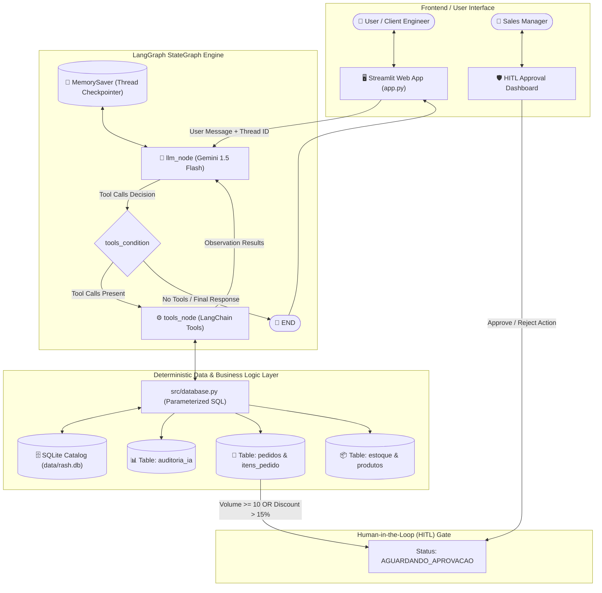
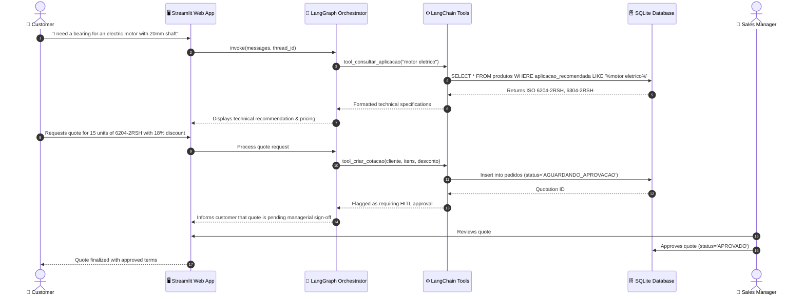

# Technical Architecture Document — RashBot

## 1. System Overview

**RashBot** is an enterprise-grade agentic B2B technical sales platform built on **LangGraph**, **LangChain**, **Google Gemini 1.5 Flash**, and a **Deterministic SQLite Catalog Layer**.

The architecture decouples conversational natural-language understanding from deterministic catalog retrieval and transactional business logic, preventing LLM hallucinations and enforcing rigorous **Human-in-the-Loop (HITL)** governance.

---

## 2. High-Level Agentic Architecture

The core agent is orchestrated using a LangGraph `StateGraph` pattern with checkpointed conversation memory (`MemorySaver`).

---

## 3. LangGraph Execution Graph & Nodes

The agent execution lifecycle is governed by an explicit StateGraph consisting of:

- **State Schema:**
  - `messages`: Sequence of LangChain messages (`HumanMessage`, `AIMessage`, `ToolMessage`, `SystemMessage`) managed by the `add_messages` reducer.
- **Nodes:**
  - `llm_node`: Injects dynamic system prompts, binds the deterministic toolset to the Google Gemini model, invokes the LLM, and logs token usage and latency.
  - `tools_node`: A `ToolNode` executing bound Python tools deterministically.
- **Conditional Routing:**
  - `tools_condition`: Inspects the output of `llm_node`. If tool calls are requested, execution transitions to `tools_node`. Otherwise, execution terminates at `END`.
- **Memory & Checkpointing:**
  - `MemorySaver`: Maintains conversation state across multi-turn sessions using unique `thread_id` keys.

---

## 4. End-to-End Data Flow

---

## 5. Architectural & Engineering Decisions

### 5.1 Deterministic Relational Database vs. Vector RAG
- **Rationale:** For technical B2B sales, vector search embeddings are prone to semantic drift and approximate nearest-neighbor errors when matching dimensions (e.g., matching $25\text{ mm}$ inner diameter with $24\text{ mm}$ or confusing clearance $C3$ with standard clearance).
- **Solution:** A relational SQLite schema with exact parametric filters ensures 100% deterministic accuracy for product codes, dimensional limits, and pricing.

### 5.2 LangGraph StateGraph vs. Legacy Sequential Chains
- **Rationale:** Technical sales negotiations are non-linear; customers alternate between describing applications, querying dimensional specs, checking stock, and adjusting order quantities.
- **Solution:** LangGraph supports multi-turn cyclic tool calling, conversation rollback, and deterministic state transitions.

### 5.3 Human-in-the-Loop (HITL) Governance
- **Rationale:** Autonomous issuance of formal quotes with unauthorized commercial discounts or volume commitments creates financial liability.
- **Solution:** Hard business rules enforce approval gates whenever quantities exceed $\ge 10$ units or requested discounts exceed $> 15\%$.

---

## 6. Security, Persistence & Compliance

1. **SQL Injection Prevention:** All queries in `src/database.py` use SQLite parameterized queries (`?` placeholders). Raw string interpolation in SQL statements is strictly prohibited.
2. **PII Protection & LGPD Compliance:** Customer identification fields (CNPJ, CPF, email) are sanitized and masked in session log outputs.
3. **Auditability & Observability:** Every LLM invocation records input tokens, output tokens, total cost estimate, and execution latency in the `auditoria_ia` table.
4. **Credential Isolation:** API keys are managed through isolated `.env` files loaded dynamically via `python-dotenv`, with `.env` explicitly excluded in `.gitignore`.
